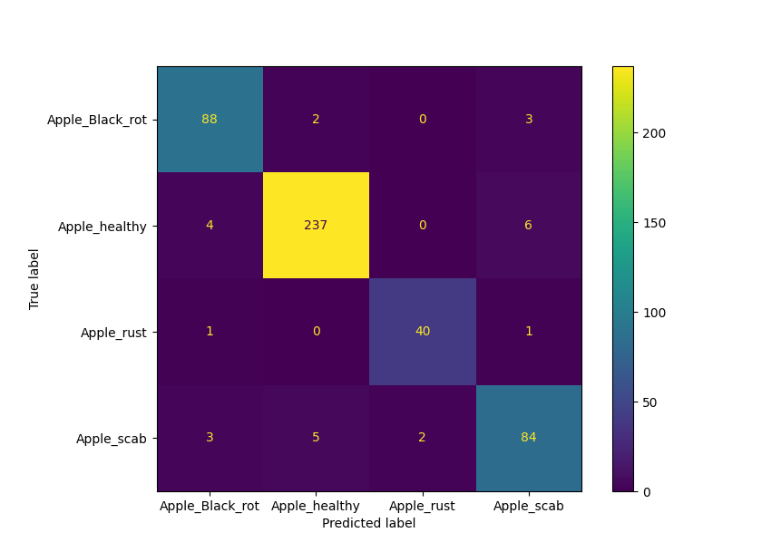

# Leaf Disease Prediction with Convolutional Neural Network

## Overview

This project implements a Convolutional Neural Network (CNN) to predict leaf diseases from images. The CNN is trained on a dataset of leaf images, with the goal of classifying the diseases accurately. The project includes image preprocessing, data augmentation, and visualization tools to enhance the training process and results.

## Table of Contents

1. [Technical Aspects](#technical-aspects)
   - [Dataset](#dataset)
   - [Model Architecture](#model-architecture)
   - [Training Process](#training-process)
   - [Evaluation Metrics](#evaluation-metrics)
   - [Image Preprocessing](#image-preprocessing)
   - [Data Augmentation](#data-augmentation)
2. [Usage](#usage)
   - [Installation](#installation)
   - [Training the Model](#training-the-model)
   - [Making Predictions](#making-predictions)
   - [Visualizations](#visualizations)
3. [Results](#results)
   - [Train and Validation metrics](#train-and-validation-metrics)
   - [Train output](#train-output)
   - [Test Metrics](#test-metrics)
   - [Confusion Matrix](#confusion-matrix)
4. [Visualizations](#visualizations)
   - [Image Transformations](#image-transformations)
   - [Color Histograms](#color-histograms)
   - [Distribution Charts](#distribution-charts)

## Technical Aspects

### Dataset

The dataset consists of images of leaves, categorized into different disease classes. Each image is labeled with the corresponding disease, allowing the model to learn the features associated with each class.

### Model Architecture

The CNN architecture is defined in the `LeafCNN` class, which includes:

- Convolutional layers for feature extraction.
- MaxPooling layers for down-sampling.
- Fully connected layers for classification.
- Dropout layers for regularization.

### Training Process

The training process involves the following steps:

1. **Data Preprocessing**: Images are resized, normalized, and split into training, validation, and test sets.
2. **Data Augmentation**: Augmentations such as rotation, cropping, and color jittering are applied to increase dataset diversity.
3. **Model Training**: The model is trained using the training set, with validation performed on the validation set.
4. **Early Stopping**: Training is stopped early if the validation loss does not improve for a specified number of epochs.
5. **Model Evaluation**: The model's performance is evaluated using the test set.

### Evaluation Metrics

The model's performance is evaluated using the following metrics:

- **Cross Entropy Loss**: Measures the difference between the predicted and true distributions.
- **Accuracy**: The proportion of correct predictions.
- **Precision**: The proportion of true positive predictions among all positive predictions.
- **Recall**: The proportion of true positive predictions among all actual positives.
- **F1 Score**: The harmonic mean of precision and recall.
- **Confusion Matrix**: A summary of prediction results for classification problems.

### Image Preprocessing

Image preprocessing is performed using the `Transformation.py` script, which includes:

- Conversion to grayscale.
- Gaussian blur application.
- Mask creation and application.
- Landmark analysis and drawing.
- Color histogram extraction and plotting.

### Data Augmentation

Data augmentation is performed using the `Augmentation.py` script, which applies random augmentations to the images to increase dataset diversity. The augmentations include rotation, cropping, brightness and contrast adjustment, perspective transformation, and blurring.

## Usage

### Installation

To run the project, ensure you have the following dependencies installed:

```bash
pip install -r requirements.txt
```

### Augmenting the Dataset

To augment one image, or balance the dataset:

```bash
python Augmentation.py <src>
```


### Training the Model

To train the model, use the following command:

```bash
python train.py <data_dir> --epochs 100 --patience 10
```

### Making Predictions

To make predictions using the trained model, use the following command:

```bash
python predict.py <image_path> <weights_path>
```

### Visualizations

To visualize image transformations and color histograms, use the following command:

```bash
python Transformation.py <file_path> <dst>
```

To visualize the distribution of images in a directory, use the following command:

```bash
python Distribution.py <directory_path>
```

## Results

### Augmentation


### Train and Validation metrics


### Train output


### Test Metrics


### Confusion Matrix



## Visualizations

### Image Transformations

The `Transformation.py` script generates visualizations of image transformations, including grayscale conversion, mask application, and landmark analysis.


### Color Histograms

The `Transformation.py` script also generates color histograms for the RGB, LAB, and HSV color spaces.


### Distribution Charts

The `Distribution.py` script generates distribution charts to visualize the number of images in each class.


